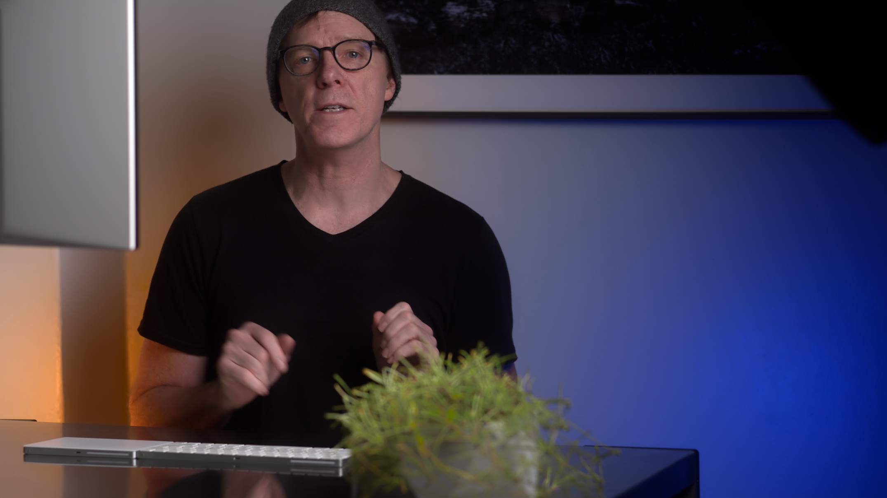
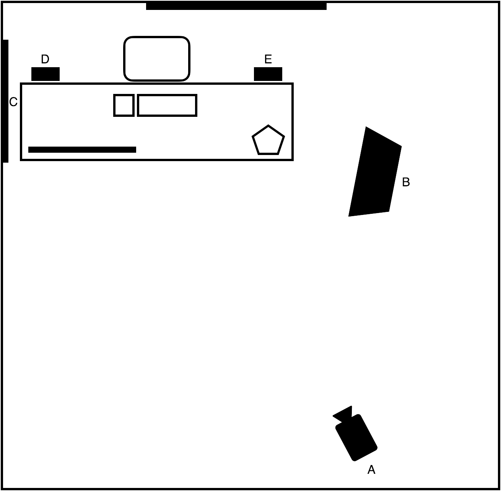
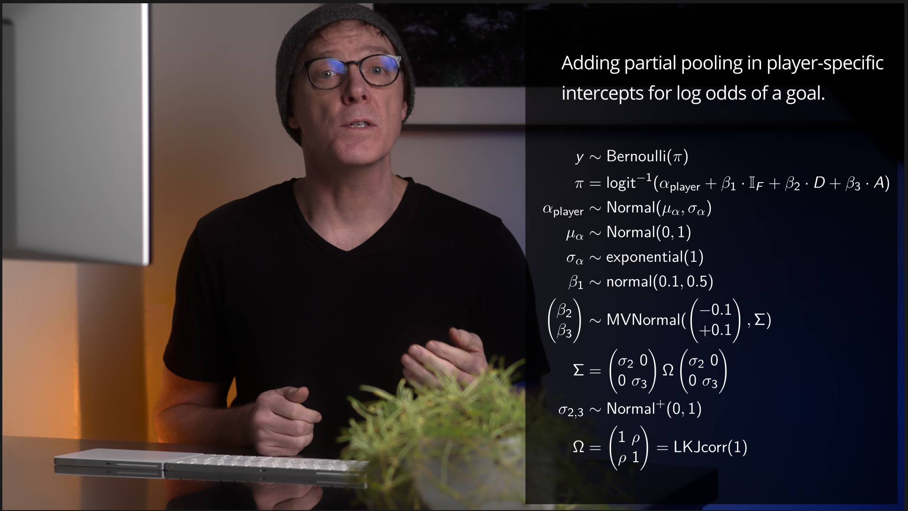
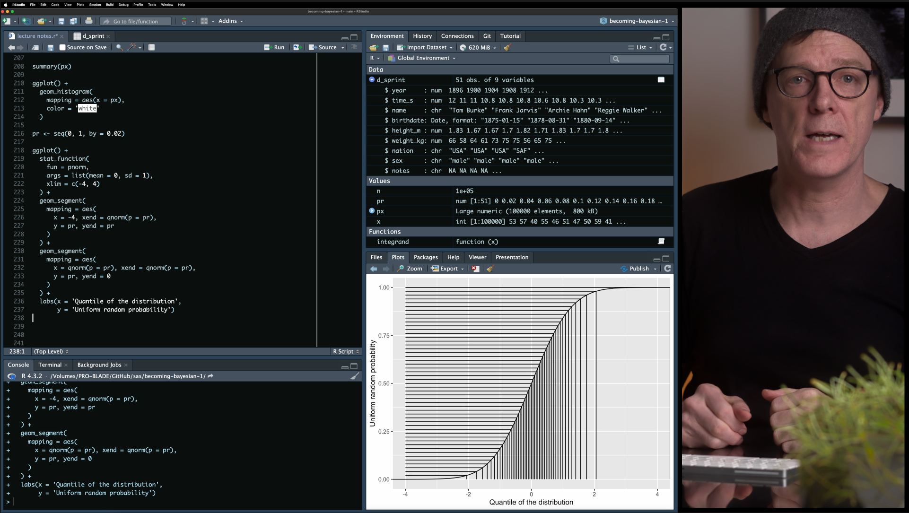
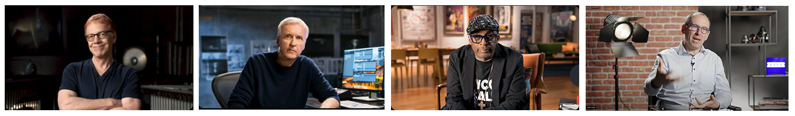

I've completed pre-production on my second, advanced course --- *Becoming a Bayesian II* --- which I intend to launch soon. As I move into production of the video material, I though it would be helpful to reflect on and share my approach last time, which resulted in launching *Becoming a Bayesian I.*

To produce the previous course *Becoming a Bayesian I*, I generally followed the production workflow described below, which includes pre-production, production, and post-production. By pre-production, I'm referring to development of course script, code, and visuals. Production refers to recording the content onto video. And post-production refers to editing content.

## Pre-production

Pre-production notes. Here, I chose to fully draft notes for **narrative** and complete working **code** before beginning to record anything onto media. I felt this would be the most efficient way to proceed. After confirming the coding approaches and notes, I planned in the course videos to verbally explain, demonstrate through live coding, and refer to visuals for math notation and definitions. The coding languages for this course included both [R](https://cran.r-project.org) and [Stan](https://mc-stan.org), and I carried out the live coding demonstrations inside [RStudio](https://posit.co)'s integrated development environment.

To write the narrative notes and complete code, I included all content in a single [quarto markdown file](https://quarto.org) as it freely allows mixing of text, latex math, code, and visuals, all of which would be in my actual lessons. Having all content together helps me to review the narrative for flow and continuity before working through the material "live" (to the camera, anyway).

The videos also include **overlays** of the math. This involved a few steps. To include these in the video, I first rendered them in a quarto document as a `beamer_presentation` where each overlay was a separate slide. I inverted the text and background color so that the text was white and background was black. Then, I opened the pdf file in Adobe Acrobat and resaved each slide as an image (`png`) file in high resolution. Once each overlay was a separate png file, I could import them into the editing software during post-production.

## Production

The set included location, practicals or props, lighting, video, and sound. I'll briefly describe each along with my reasons for choices. The overall look has been described as similar to so-called master classes.

I should stress that my choices were made within my constraints with space (corner of room) and equipment (stuff I already have). While not ideal, within these constraints I aimed to follow certain film making concepts, which resulted in \@fig-basic-still below:

And the layout of the setup is shown below:

The setup included me as the subject in focus, sitting behind a desk, showing a keyboard and track pad, and a portion of a computer screen, a foreground plant, and wall background with a picture on the wall. To control lighting consistency and quality, the two room windows were blacked out and no room lights were used.

The [main light](https://www.kelvinlight.com/product/epos_300_full_color_spectrum_rgbacl_led_studio_light/) (B) included a [three foot softbox](https://broncolor.swiss/products/octabox-75-cm-2-5) with a [40 degree grid](https://broncolor.swiss/products/light-grid-40-for-octabox-75-2-5?variant=3443) raised to a height where the bottom of the softbox was about even with my chin, and the light direction was across the face but in front such that limited light hit the background wall. Something like 45 degrees from front and 30-45 degrees down. You can actually see the lower edge of my softbox in the upper right of \@fig-basic-still (a mistake, but because it was a darker section I left it as is). Reflections from the opposing wall were limited by placing black (Duvetyne) cloth (C) on the wall. The lighting goal for this position was to achieve "[Rembrandt lighting](https://en.wikipedia.org/wiki/Rembrandt_lighting)" (creating a triangle of light on the shadow-side cheek) on the subject's face, which is to create depth or a more three dimensional look. The color for light (B) was set to daylight: 5,600 Kelvin. The positioning also allowed for a [catchlight](https://www.studiobinder.com/blog/what-is-a-catchlight-photography/) in the eyes, which is noticeable in all three frames (\@fig-basic-still, \@fig-math, \@fig-coding). And the brightness value (luminance) was set to a) keep the subject brighter than the background and b) enable the lowest ISO value in camera (which reduces noise).

To create **contrast separation** between the subject and background, I wore black clothing (contrast, skin) and used two additional [led lights](https://www.kelvinlight.com/product/play_full_color_spectrum_rgbacl_led_panel_pocket__light/) (D and E) to include color contrasts. As the wall was plain white, two secondary lights were directed towards the background wall and set in complementary hues: orange (Lee 2/1 CTO) and blue (Lee 2/1 CTB). These hue and saturation were also chosen to compliment the theme of the hosting site, which in my opinion reflects an old-school, video-game design language. The only feature on the wall was a hanging image, and I used a large lens aperture ([f2 on 90mm lens](https://leica-camera.com/en-US/photography/lenses/m/apo-summicron-m-90mm-f2-asph-black)) on [main camera](https://leica-camera.com/en-US/photography/cameras/sl/sl2-s-black) (A) to try to blur the background and further create subject-background separation[^1].

[^1]: If I had an auto-focus lens with a larger aperture (f1.4), I would have used that to increase the background blur a bit more. But I would not use something like the "blur background" software feature in video conferencing tools because it looks fake and distracting.

::: callout-note If I had more room space, it would be better to arrange the desk further from the background (closer to main camera) to improve separation between them, and include something in the background (practicals) for visual interest. With more space, it would also be compositionally advantageous to include a full [three-point lighting setup](https://theasc.com/blog/shot-craft/the-talking-head) (I'm missing fill and edge lights) and use multiple camera views. :::

The subject positioning in the frame, a bit off center left, was a compromise between the idea of a centered frame to project authority (in an educational sense) with some required space to overlay information in the frame (such as math equations):

Along with the two above frames(\@fig-basic-still and \@fig-math), a third frame enabled a view for live coding:

{#fig-coding fig-align="center" width="80%"}

In this third frame, I used a **split frame composition** where I appear to be looking toward the code (left) when I'm actually looking at my computer screen, hoping to create continuity between this frame and the main frame (\@fig-basic-still) that partially included my computer screen. For the same reason, I included part of the keyboard in the split view, so as to create continuity between what I'm doing and the code changing to the left. That I'm now split-screen right in this frame helps to give the appearance of a second camera angle[^2] even though it is not; it's just cropped and moved. I discuss this below, in post-production notes.

[^2]: Filming with multiple camera angles add a lot to visual interest and also have the advantage of providing options during editing for hiding jump cuts. If I had an additional camera, I would setup multiple cameras for these purposes.

Here are a few **reference examples** that embody the compositional principles I aimed for:

Each of these reference examples include best-practices in lighting, camera, and composition in the context of an interview or tutorial setting. Compared with these, my compositions could improve by increasing subject-background contrasts in lighting (as well as alternating dark-light contrasts), including more space between subject and background, and adding a few (blurred) background elements of interest. They also include a little visual space between the top of their heads and the edge of the frame. The second of these references (with James Cameron) would be especially interesting to consider compositionally as the front of the computer screen is visible in the background. This could be useful in another camera viewpoint to add continuity between talking and coding.

For **capturing voice**, I taped a [lavalier microphone](https://www.dpamicrophones.com/lavalier/4060-series-miniature-omnidirectional-microphone) under my shirt and attached it through a long wire directly to main camera (A).

Finally, for the live coding, I used [Apple's QuickTime player](https://support.apple.com/guide/quicktime-player/welcome/mac) to **screen record** simultaneously with the main camera (A) and included a second microphone to the screen recording so that I could sync[^3] with the main video later.

[^3]: This works fine, but if I had timecode equipment, I would have used it instead or in addition to audio sync.

The remaining visual effects --- titles and definitions --- were included in post-production.

::: callout-note

## Equipment choices

I should note that there is nothing special about the specific brand of equipment I have linked above; Those are just what I had available. Lower cost equipment with similar functionality would do just as well. A main light probably needs at least 300 Watts, but could be just daylight balanced, and can be found used. Here's an [example](https://www.bhphotovideo.com/c/product/1721572-REG/godox_vl300ii_series_300w_led.html) that can be purchased for a third or quarter of the cost to the one I used. It is helpful to also include a softbox as the size of the light source and distance from subject determines how "soft" the light is; again, here's a [lower cost option](https://www.bhphotovideo.com/c/product/1622464-REG/aputure_amolightdomese_lantern_90.html).

Any other lights can have less power, and if color contrasts are desired, then these should be led lights where the color can be set. Here's a [lower cost example](https://www.bhphotovideo.com/c/product/1552705-REG/godox_rgb_mini_creative_m1.html). Other than light quality, the other consideration is noise as lights have fans to cool them.

For the camera, I do recommend a full-frame mirrorless, and a lower cost alternative to what I used might be something like a [used Lumix S5II](https://www.keh.com/shop/28205979.html), for between \$1K-2K; but you could even go cheaper and be fine. The lens will depend on if you want auto focus or manual focus, but get one with a large aperture for background separation. The focal length will depend on how much room the location gives for setting up, but I'd recommend at least a 35mm to avoid distorted faces, etc; maybe something [like this](https://shop.panasonic.com/products/s-series-50mm-f1-8-l-mount-lens?_pos=5&_fid=346b3298a&_ss=c) but used. :::

To capture the main video, I used 23.976 frames per second, 4K video, and log profile.

## Post-production

Once I finished recording all content, I set about editing the material into the final video. As my primary tool, I edited with [Davinci Resolve Studio](https://www.blackmagicdesign.com/products/davinciresolve/studio), though all or almost all editing tools are available in the free version[^4]. Editing included the steps of media organization, placement into a timeline, editing, color, visual effects (transitions), titles and overlays, sound design, and rendering. Here's a [beginner video tutorial](https://youtu.be/qDHnCFMZ9HA?si=JpMPWbi5wMgpRXo-) for using the tool, though the author covers much more than what I used.

[^4]: Final Cut Pro or Adobe Premiere is also a good alternative.

After creating a timeline, I dropped all the main camera footage onto the timeline, and then added a second video layer and placed the corresponding screen recordings. For each video pair, I used audio sync so that their timing matched. QuickTime screen recordings are, I believe, always at 60 frames per second, but the audio sync did a fair job of retiming the screen recordings. Next time, I would probably increase the main camera to exactly 30 frames per second so that it is exactly half the screen recordings. And it would be even better to use timecode.

For **chapter titles**, I used the title effect in Resolve called "Long title" for a duration of 5 seconds. For **subsection titles**, I used the title effect called "lower third" but moved it to the upper right and played with font size to fit with the background, etc. To help with **jump cuts**, I sometimes used the video transition called "smooth cut"; but I have room for improvements in these edits. And for definitions, I used a video title called "clean and simple", again playing with font sizes.

I colored the main video by using a color space transform, which transformed the log footage to editing colorspace (davinci wide gamut), and then another transform from my working color space to Rec. 709.

As my mic picked up a bit of noise from the city from time to time, I also used "voice isolation" on the audio track.

To render the final video, I added markers on the timeline at each chapter or subchapter where I wanted the next video clip to start. Codec was H.265 at 4K resolution and 23.976 frames per second.
