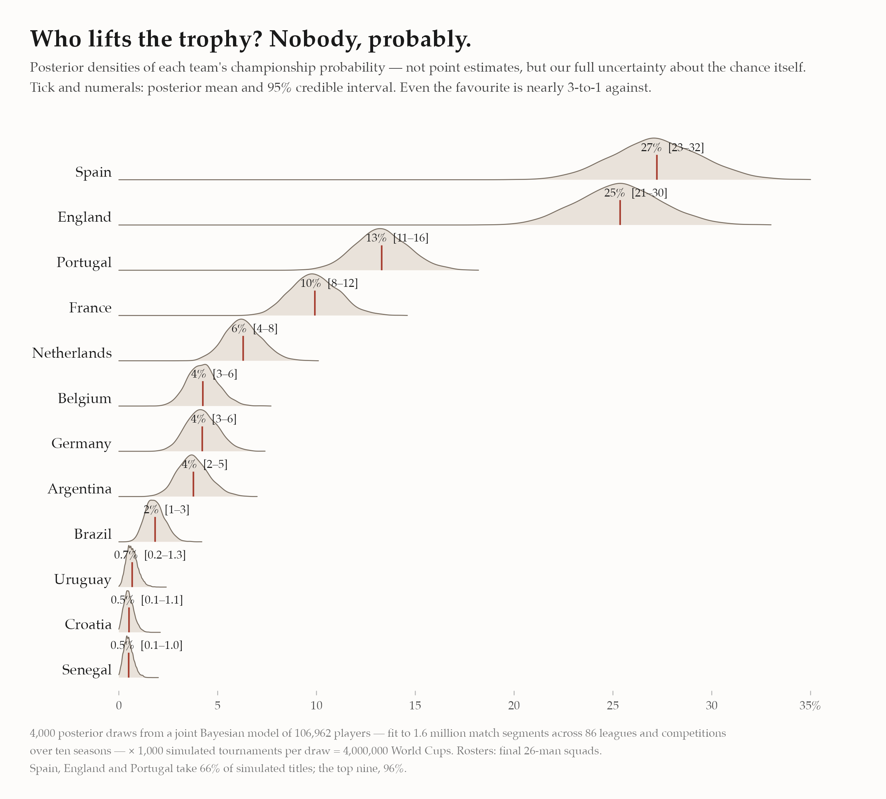
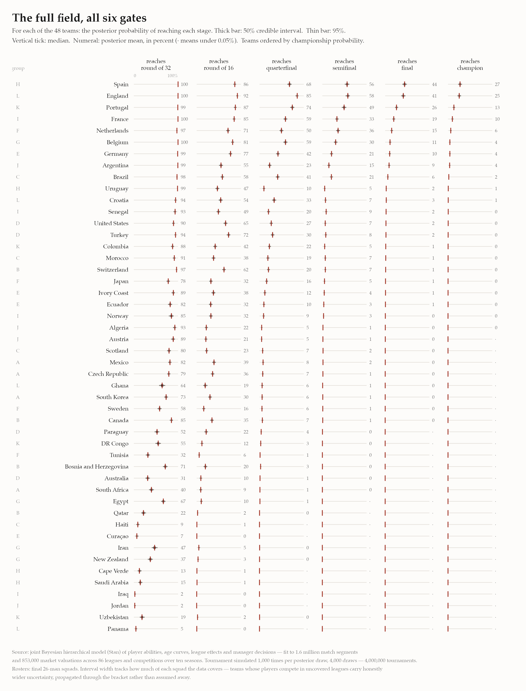

*The 2026 World Cup kicks off today. I simulated the whole tournament four
million times --- and unlike most forecasts you'll read this week, mine tells
you how sure it is.*

## The number everyone publishes, and the number almost nobody does

Every World Cup forecast gives you a number: *Spain 27%*. Useful, but it
hides a question that matters just as much: **how well do we actually know
that number?** A model that has watched a player's whole career should be
more confident than one squinting at six months of form. A squad full of
household names playing in well-measured leagues should carry tighter
uncertainty than one whose players we've barely observed.

So I don't publish a probability. I publish the **distribution of the
probability** --- a full Bayesian answer.

Spain leads at **27% [23–32]**. That bracket isn't decoration; it's the
model saying *given everything I know about every Spanish player --- and
everything I don't --- the title chance is somewhere in here.* Even the
favourite is nearly 3-to-1 against. Football's single-elimination format
guarantees that nobody, however good, is ever *likely* to win.

A few things only visible because the answers are distributions:

- **Spain vs England is closer than the means suggest.** Their densities
  sit nearly on top of each other (27% vs 25%), and across the posterior,
  Spain is the stronger pick in only 69% of draws. Germany vs Argentina is
  even tighter --- 4.2% vs 3.8%, with Germany ahead in just 64% of draws.
  Any forecast ranking those pairs cleanly is reporting noise.
- **Concentration at the top:** Spain, England and Portugal account for 66%
  of simulated titles; the top nine take 96%. The other 39 teams share what's
  left.
- **The boldest call is Brazil at 1.8%.** The market says roughly ten
  percent; the model looks at the actual 26 names --- Casemiro at 34, Neymar
  at 34, Alex Sandro at 35 --- and prices an XI past the peak of its age
  curves. One of those views is wrong, and that disagreement is exactly what
  a generative model is for: every assumption behind the 1.8% is inspectable.

## Six gates, forty-eight teams

The tournament is six gates: reach the round of 32, the 16, the quarters,
the semis, the final, win it. Below, every team's chance at every gate ---
with its 50% and 95% credible intervals, because a number without its
uncertainty is an opinion.

Reading it as a fan:

- **England's strange shape.** England is *more* likely to reach the
  quarterfinal (85%) than any other team, because their draw is soft exactly
  where others' is brutal: their projected round-of-16 tie is a 93% pass ---
  nearly a bye --- while Argentina's is a 42% coin flip that leans against
  them. Bracket geography is destiny.
- **Sixteen teams will fly home after three games.** The bottom of the
  table is not pessimism; it's arithmetic plus evidence. Iraq's 2.4% chance
  of escaping the group is what happens when most of a squad plays in
  leagues the data doesn't cover.

## Curaçao: missing data, properly imputed --- then the data arrived

When this forecast was first built, no announced Curaçao player matched the
modeled leagues, so the model faced a missing-data problem. The Bayesian
answer is imputation from the model itself: their abilities were drawn, each
posterior draw, from the population distribution of player abilities the
model had already learned. No made-up rating --- just a wide, honest
interval, propagated through every match of the bracket: their round-of-32
chance read **10% [2–25]**.

Then the final 26-man squads were announced, most of Curaçao's squad turned
out to play in covered leagues after all, and the imputation was replaced by
actual player histories. The forecast is now **7% [4–10]** --- the interval
collapsed from twenty-three points wide to six, and the mean fell, because
the population prior had been a touch generous to them. That movement is the
method working: when data is missing you say so with width, and when data
arrives, the width gives way to it.

This is the part I'd highlight for anyone evaluating modeling work: missing
data handled inside the same generative model as everything else, so the
answer carries exactly as much uncertainty as the data warrants --- no more,
and no less, at every stage of knowledge.

## What's under the hood

This isn't an Elo system or a betting-odds aggregator. It's a single **joint
Bayesian hierarchical model** --- more than 220,000 parameters, [hand-tuned
C++ gradients](/post/hand-coded-cpp-gradients-for-stan/), fit with
Stan to ten seasons of data across 86 leagues and competitions: 1.6 million
match segments, 853,000 market valuations, and 27,000 national-team
selection events, covering 106,962 players. Jointly, the model learns:

- **per-player offensive and defensive ability**, correlated, with
  position-specific **age curves** (a 23-year-old midfielder and a
  31-year-old striker age differently);
- **league scoring environments** (the same player produces different goal
  rates in different competitions --- measured, not assumed);
- **manager behaviour** --- who gets selected, who gets substituted, and when,
  as a function of ability and game state;
- **market values, national-team call-ups, and career survival**, which
  sharpen player abilities through entirely different channels of evidence.

Because everything is estimated *jointly*, uncertainty flows end-to-end. The
tournament simulation isn't bolted on: for each of 4,000 posterior draws I
build every nation's best XI (a 4-2-3-1, selected by that draw's abilities),
score matches with the model's own goal process --- zero-inflated, with
match-level shared frailty --- and play all 103 matches that decide the title,
1,000 times over. Four million World Cups, each one consistent with a
different, fully-specified state of belief about every player the data has
measured.

The same machinery that simulates a tournament answers the questions clubs
actually pay for: what is this player worth, how will he age, what does he
add to *this* squad against *this* opposition. The World Cup is just the
fun part.

## After the whistle

Today at the Azteca, the first whistle collapses four million World Cups
into one. Every density on this page narrows, match by match, into the
single tournament we actually get to watch --- one draw from the
distribution, unrepeatable, and quite possibly won by nobody the model
favours. That isn't a failure of the forecast; it *is* the forecast. A 27%
favourite goes home empty nearly three times in four. The point of
simulating four million World Cups was never to predict the one that
happens. It was to know exactly how surprised to be.

---

*Model: joint Bayesian hierarchical model in Stan with custom C++ gradient
kernels. Rosters: the final 26-man squads, matched to the player database,
with each player's age taken at the tournament itself. Venue advantage not
modeled (neutral-site assumption). Penalty shootouts treated as coin flips
--- even four million simulations can't tell you who blinks from twelve
yards. Quietly updated June 12, 2026, from the provisional squad lists used
at first publication to the final squads --- the numbers here are the
current pre-tournament forecast.*
