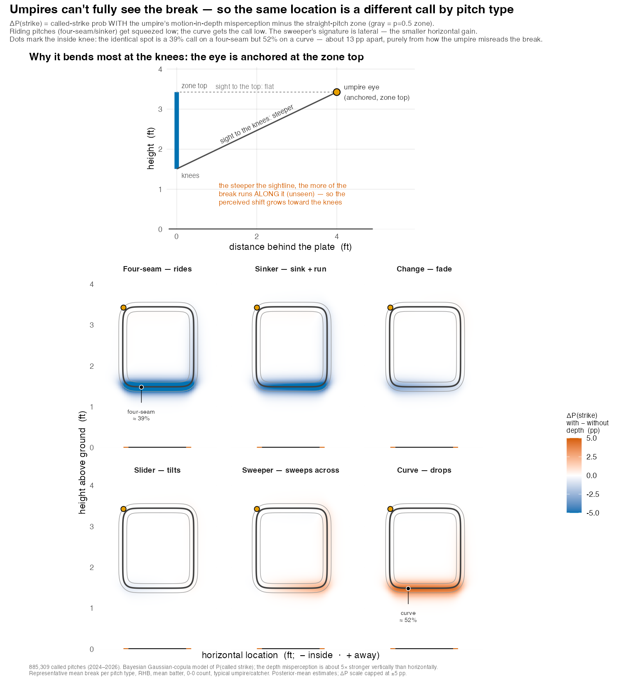

# The puzzle: the same spot, a different call

Take two pitches that cross home plate at the *exact* same point — same height, same width, low and on the inner edge. One is a four-seam fastball that rode up on its way in; the other is a curveball that dropped through the bottom of the zone. Statcast records them as crossing the identical location. My model of how umpires actually call pitches says they are not the same call at all.

At the inside knee, for example, the four-seam is a **39%** called strike and the curve a **52%** called strike — a gap of about **13 percentage points** at one spot on the plate, with nothing different between the two pitches but their movement (see the figure below). They arrive in the same place; the umpire judges them differently because of how that movement is *perceived* on the way there.

This is not pitch framing, not the count, not the batter, not which umpire is working. It is a quirk of human vision, and once you account for it, it is large, systematic, and — as far as I can tell — not something anyone has put a number on before.

# What this is *not*: the break Statcast already reports

**Motion-in-depth is a fact about the *umpire*, not the ball.**

Statcast already reports a pitch's **break** — its horizontal and vertical movement, the inches a curveball drops or a fastball rides relative to a spinless trajectory. That is a measurement of *the ball*: how it moved through space, the same number no matter who is watching, or whether anyone is watching at all.

Motion-in-depth is a different thing entirely. It is a fact about *the observer*. Human vision is markedly worse at perceiving motion directed **along the line of sight** — toward or away from us — than motion **across** it [@gray2006; @gray2002]. The umpire crouched in the slot behind the catcher is sighting down a particular line at the ball as it crosses the plate. Part of every pitch's break runs *along* that line of sight, and that part is precisely the part the umpire is least equipped to see.

So the reported break is the **input**; the perceptual shift is what the umpire's eye **fails to do** with it. Two pitches with the same crossing location but different break carry different amounts of unseen, along-the-sightline motion — and so get judged differently.

Two explanations for that gap sound alike but are opposites. One credits the movement the umpire can see — the pitch is genuinely in a different place, or the umpire tracks its flight and adjusts. The other, the mechanism estimated here, has the umpire misjudging an *identical* crossing location, because a component of the movement runs along the line of sight, where the eye cannot resolve it. The break is real and measured; the error is in the eye.

# What it is: motion-in-depth and the umpire's sightline

The perceptual fact is well established. Across reaching, catching, and batting, people estimate motion toward or away from them less precisely than motion side-to-side, because the depth cues (binocular disparity, looming) are noisier than the lateral signal on the retina [@gray2006; @gray2018a]. In baseball, though, the idea has lived almost entirely in the academic literature, and mostly on the *batter's* side — how hitters time a swing and judge where a pitch will be [@gray2002; @gray2013]; I have argued it also shapes pitching strategy, since same- and opposite-handed matchups present different amounts of movement inside the batter's plane of sight [@spencer2023]. Whether it has actually been built into how pitches are modeled — in public work, and as far as I can tell inside teams — is far less clear. That gap is partly one of tooling: a specific viewing geometry feeding a known perceptual limitation is exactly the kind of thing a Bayesian model with the physics built in can state outright — the sightline projection and its gain become explicit parameters, with priors and credible intervals — whereas the gradient-boosted, feature-fed models that dominate pitch analysis [@grove2023; @drivelinebaseball2021] would have to rediscover the geometry from correlations, and would tend to absorb it as noise rather than name it as a cause.

Here I take it to the person whose entire job is judging location: the **home-plate umpire**. The geometry is concrete. The umpire's eye sits a few feet behind the plate, in the slot just to the inside of the catcher [@umpirebible2020]. Draw the line from that eye to the ball at the moment it crosses. A pitch's break is not an instantaneous jog but an accumulation — the lift (velocity-perpendicular) acceleration integrated over the whole flight, $\mathbf{d} = \int_{0}^{t_f}\!\!\int_{0}^{t}\mathbf{a}_{\text{lift}}\,dt'\,dt \approx \tfrac{1}{2}\,\mathbf{a}_{\text{lift}}\,t_f^{2}$. That accumulated deviation splits into the part **across** the line of sight (which the umpire perceives well) and the part **along** it (which they do not), and the unseen along-the-line part shifts where the umpire judges the ball to be.

There is also a difference in dimension worth being explicit about. The perceptual studies isolate the depth-versus-lateral asymmetry in controlled, essentially two-dimensional viewing — motion in depth against a single lateral direction, often in a simulator or a reduced display [@gray2006; @gray2002]. The umpire's problem is irreducibly three-dimensional, and the relevant depth axis is not the ball's direction of travel but the umpire's *line of sight* — the ray from the eye (set behind, above, and to the inside of the plate) to the ball as it comes in. That ray sweeps inward over the flight; by the moment the ball reaches the plate, where the call is made, it has swung to the crossing point, and what it projects there is the deviation the ball has accumulated the whole way in — the integral above. Resolved against that ray, the unperceived component casts a shadow on *two* plate axes at once — vertical and horizontal — and separating them is exactly what the per-axis gains $\kappa_{csz}$ and $\kappa_{csx}$ do.

Two features of the geometry give the effect its shape:

- **It is mostly vertical.** The umpire has strong horizontal reference cues — the plate, the catcher, the batter's box — so the *sideways* shadow of the depth motion largely washes out. The *vertical* shadow does not. My estimates put the vertical effect about five times the horizontal one (more below).
- **It is strongest at the knees.** The umpire's eye is anchored near the *top* of the zone. So the sightline is nearly flat to the top of the zone but steepens as it drops to the knees — and the steeper the line, the more of the break runs along it, unseen. The misjudgment, and the call changes it produces, grow toward the bottom of the zone. The top panel of the figure below shows this directly. (The hitter is the extreme case: looking straight down the ball's incoming line, the batter's poorly-seen axis is the *whole* approach — read not just to place the pitch but to *time* the swing. The same blind spot, far more of it; more below.)

# Visualizing the misperception

Reading the bottom row left to right is reading the vertical break from most up (four-seam) to most down (curve). A riding four-seam loses ~5–8 points of called-strike probability along the bottom edge — it is **squeezed**. A curve gains ~4–5 points there — it **gets the call**. The two effects point in opposite directions against the same straight-pitch reference, which is why a four-seam and a curve at one spot can sit ~13 points apart. The slider, change, and sweeper fall in between, with the sweeper's signature tilted sideways rather than vertical — the small horizontal piece.

The figure depicts representative conditions — a typical right-handed batter at a neutral (0–0) count, a typical umpire and catcher, each pitch type drawn at its *average* break, from posterior-mean parameters. It is meant to isolate the mechanism and show its size, not to forecast any one pitch: an unusually sharp curve or a high-ride four-seam moves more, and there is real spread within a pitch type. The claims that carry weight are the per-axis decomposition and its credible intervals (next); the single-spot percentages are there to make the magnitude tangible.

# What the model finds

The motion-in-depth term is one component of a structural model of the called strike zone, fit to 885,309 called pitches (2024–2026; 99 umpires, 856 batters, 142 catchers). It enters as a perceived-location shift with a *separate gain on each axis* — vertical and horizontal — and estimating the two separately is the point: it lets the data say which axis the misperception lives on rather than assuming it.

The answer lands firmly on the vertical — about **five times** the horizontal effect. The horizontal piece is small but not zero: on a smaller, early-season sample it was indistinguishable from zero (which would have read as "vertical only"), and only at full scale does it resolve to a real, if minor, effect. So the umpire's depth misperception is *predominantly* vertical, not *exclusively* so.

And the term earns its place rather than just fitting more flexibly: adding it measurably improves the model's predictions of held-out calls, so it is capturing signal rather than absorbing noise — the standing worry with any added parameter.

The model gives each taken pitch a probability of being called a strike. The zone is a **Gaussian-copula bivariate-logistic** surface: two soft edges (a width edge and a height edge), coupled by a latent correlation that produces the familiar rounded-square corners rather than a sharp box. On top of that sit the structural pieces that make it a model of an *umpire* rather than a rulebook:

- an **eye-anchored angular eccentricity** — the boundary is crisper up-and-in (near the umpire's central line of sight, ~4 ft back) and softer down-and-away;
- a **per-umpire consistency** term — a multiplicative blur on the edges, so some umpires have a knife-edge zone and some a fuzzy one;
- **hierarchical batter, umpire, and catcher effects** — the catcher effect is pitch framing, here separated cleanly from the umpire and the count;
- a **stance-tracked zone** — the zone's center and height follow the batter's stance, reconstructed from listed height via anthropometry [@gordon2014], against the rulebook definition [@mlbrules2023];
- the **motion-in-depth** term described above.

The induced break is computed from the Statcast nine-parameter release state — the velocity-perpendicular (Magnus) acceleration integrated over the flight [@kagan2017; @nathan2008] — *inside* the likelihood, so the sightline projection uses the umpire eye that the zone parameters themselves imply. Estimation is full Bayesian via Hamiltonian Monte Carlo in Stan [@standevelopmentteam2025; @gelman2013b], with an analytic C++ likelihood for speed; the reported fit is four chains with no divergences and $\hat R \approx 1.00$.

# Why it matters

- **Evaluating umpires fairly.** A "miss" low in the zone on a sharp curve and a "miss" low on a riding fastball are not the same kind of mistake. One is closer to a predictable consequence of human vision than a lapse in judgment. Grading umpires against the rulebook location alone charges them for an illusion.
- **Evaluating pitchers and pitch design.** Part of what looks like a pitcher "stealing" strikes at the bottom of the zone may be the pitch type exploiting the umpire's depth blind spot — a real, repeatable edge, but one attributable to *movement*, not command.
- **Where human calls and a geometric zone diverge.** A camera system measures the rulebook location; a human sees it through the perceptual filter described here, so the two will not agree everywhere — and not at random, but concentrated where motion-in-depth bites, low and pitch-type-dependent. Wherever both are in play — a challenge system, an audit, a training aid — this model anticipates where they part and by how much. That is a description of human vision at the plate, not a claim that either call is the correct one, and not a case for replacing the umpire.

And the umpire is the *mild* case. A stationary judge making a location call feels motion-in-depth as a few percentage points at the edge of the zone. The batter — who must also decide *when* to swing — feels the same perceptual limitation far more sharply: the unperceived depth motion corrupts *when* as well as *where*, driving swing-timing errors of tens of milliseconds and much of swing-and-miss [@gray2002]. That is a substantially larger effect, a bigger model than this one, and the subject of separate work.

# References
